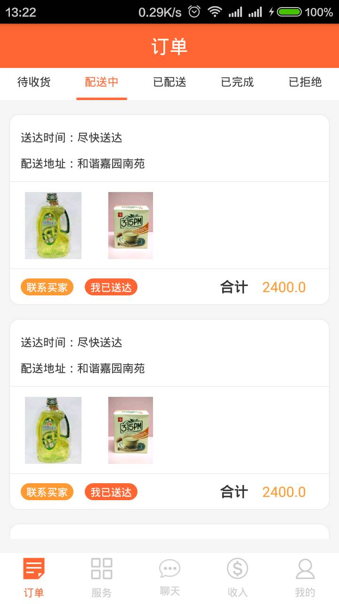
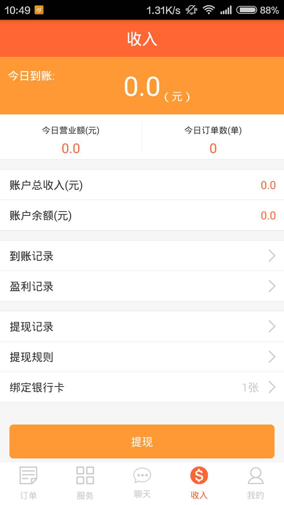
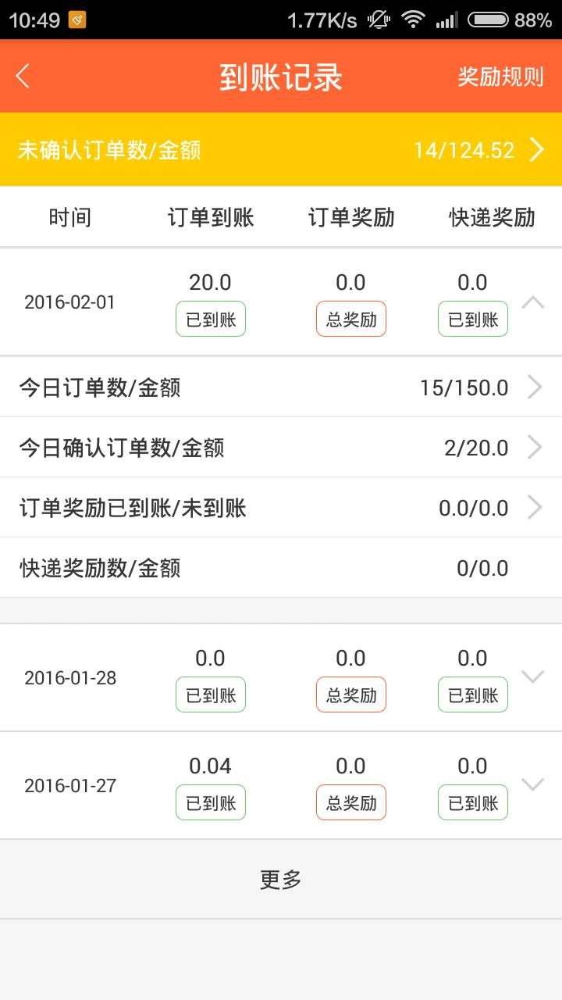
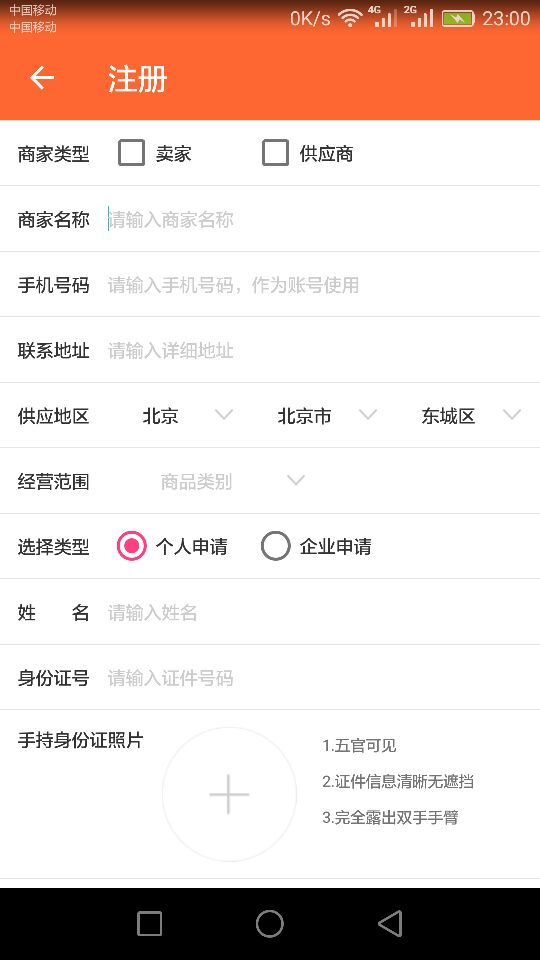

# 来一单卖家版

   该项目是来一单社区服务的商家版本。“来一单”是国内的网上便利店创业平台，它通过一款手机APP，一方面，让社区居民可以足不出户购买日用品，线上下单。另一方面，可以让小微创业者把便利店开到网上，节约房租等成本，在服务邻里的同时实现财富积累。

# 技术要点

  使用ORM数据库框架Greendao处理城市列表、商品分类、账户等数据

  使用easyPermission框架进行6.0权限管理
  
  简单封装OKHttp实现异步通信、文件上传、文件下载
  
  使用ImageLoader加载图片、缓存图片
  
  使用zxing框架实现二维码、条形码扫描功能
  
  使用Bluetooth连接打印机打印小票
  
  使用支付宝支付、微信支付
  
  使用高德地图实现定位功能
  
  使用极光推送实现消息推送等功能
  
  接收系统开机广播实现开机启动功能

    
# 截图

